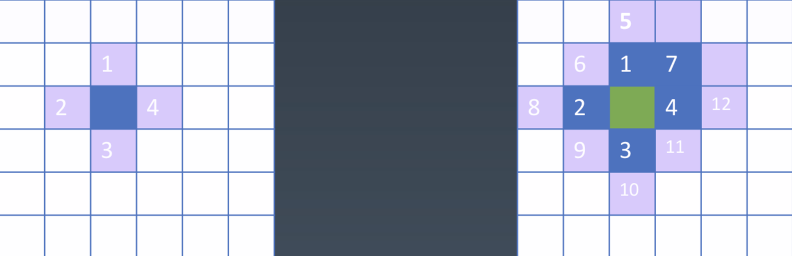
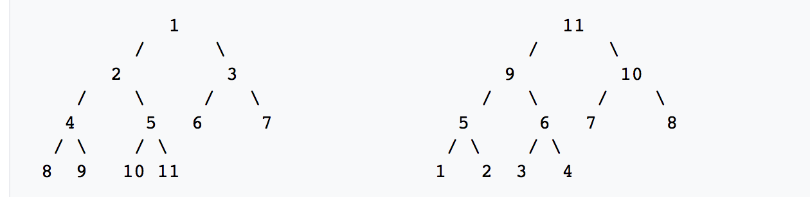

## 寻路问题算法

### 问题描述

在设置路障的情况下自动寻找从起点(0,0)到终点(X,Y)的最短路径

### 实现功能

- 点击鼠标左键划过的网格变成设为路障，点击右键划过可清除网格
- 实现使用localStorage将设置路障保存功能
- 输入终点坐标可搜寻出从[0, 0]位置到终点的最短路径

### 具体实现

**1. 绘制网格**
    
   使用一个长度个100000的数组map绘制一个100*100的网格，document监听mousedown和mouseup事件，每个cell监听mousemove事件，这可使用鼠标来绘制路障。
   
   如下图所示：
   
   
**2.寻找路径**
   
   从起点到终点寻找出路径，应从起点出发，从周围扩散不断搜索整个map，直到直到终点位置。如图所示:
   
   
   新建队列quene，不断将周边的坐标插入队列中，通过暴力搜索，目的是系统地展开并检查图中的所有节点，以找寻结果。这种算法为[广度优先搜索(BFS)](https://zh.wikipedia.org/wiki/%E5%B9%BF%E5%BA%A6%E4%BC%98%E5%85%88%E6%90%9C%E7%B4%A2)
   
   寻找路径代码如下：
   
   ```
       async function findPath(map, start, end) {
    map = map.slice();
    // 定义队列，从一侧入对，从一侧出队, 广度优先搜索
    let quene = [start];
    
    // 将搜索
    async function insert([x, y], pre) {
        if(map[100 * y + x] !== 0)
            return;
        if(x < 0 || y < 0 || x >= 100 || y >= 100) 
            return;

        map[100 * y + x] = pre;
        container.children[y * 100 + x].style.backgroundColor = 'lightgreen';
        await sleep(1)
        quene.push([x, y]);
    }
    
    while(quene.length) {
        // 队列在后端进行插入操作，在前端进行删除操作, push() shift()   
        let [x, y] = quene.shift();

        // 找到终点之后 复原出找到终点的路径
        if(x === end[0] && y === end[1]) {
            let path = [];
            while(x !== start[0] || y !== start[1]) {
                path.push([x, y])
                container.children[y * 100 + x].style.backgroundColor = 'pink';
                await sleep(5);
                [x, y] = map[y * 100 + x];
            }
            return path;
        }
        
        // 将直线坐标插入队列
        await insert([x - 1, y], [x, y]);
        await insert([x + 1, y], [x, y]);
        await insert([x, y - 1], [x, y]);
        await insert([x, y + 1], [x, y]);
        // 处理斜线左边插入队列
        await insert([x - 1, y - 1], [x, y]);
        await insert([x + 1, y + 1], [x, y]);
        await insert([x + 1, y - 1], [x, y]);
        await insert([x - 1, y + 1], [x, y]);
    }
    return null;
}
   ```
  
   >*队列：*  队列（queue），是先进先出（FIFO, First-In-First-Out）的线性表。在具体应用中通常用链表或者数组来实现。队列只允许在后端（称为rear）进行插入操作，在前端（称为front）进行删除操作
  
  
**3.启发式算法**

   由上可以看出其算法的弊端，漫无目的的遍历寻找浪费了效率，我们可以使用启发式搜索。
   
   我们可以新建一个集合（collection）取出集合中和终点最近的点，作为目标点，将其周边的坐标插入集合中，这样就可以大大提高的搜索的效率了。
   
   定义个Sorted类,可插入新的坐标点，可取出数组里终点最近的点。该类取出的时候通过将数组遍历比较则算法时间复杂度O(N)
   
   ```
      class Sorted {
	    constructor(data, compare) {
	        this.data = data;
	        this.compare = compare;
	    }
	    take() {
	        if(!this.data.length) 
	            return ;
	        let x = this.data[0];
	        let index = 0;
	        for(let i = 0; i < this.data.length ;i++) {
	            if(this.compare(this.data[i], x) < 0) {
	                x = this.data[i];
	                index = i;
	            }
	        }
	        this.data[x] = this.data[this.data.length - 1];
	        this.data.pop();
	        return x;
	    }
	    insert(v) {
	        this.data.push(v);
	    }
	    get length() {
	        return this.data.length;
	    }
	}
   ```
   
   集合collection为类Sorted的一个实例
   
   ```
   function distance([x, y]) {
        return (x - end[0]) ** 2 + (y - end[1]) ** 2
    }
    let collection = new Sorted([start], (a, b) => distance(a) - distance(b));
   
   ```
  
   
   > *启发式算法:* 计算机科学的两大基础目标，就是发现可证明其运行效率良好且可得最佳解或次佳解的算法。而启发式算法则试图一次提供一个或全部目标。例如它常能发现很不错的解，但也没办法证明它不会得到较坏的解；它通常可在合理时间解出答案，但也没办法知道它是否每次都可以这样的速度求解。


**4.使用二叉堆数据结构**

以上Sorted的比较算法为时间复杂度O(N)，不够快速，我们可以使用二叉堆数据结构将降为时间复杂度O(logN)。

二叉堆是一个树状结构，每个父节点可以有两个子节点，当父节点的键值总是大于或等于任何一个子节点的键值时为“最大堆”。当父节点的键值总是小于或等于任何一个子节点的键值时为“最小堆”。如下图所示：



使用数组存储第n个位置的子节点分别在2n和 2n+1，父节点为Math.floor((n - 1)/2)

在数组的最末尾插入新节点。然后自下而上调整子节点与父节点：比较当前节点与父节点，不满足“堆性质”则交换。从而使得当前子树满足二叉堆的性质。这样比较高度h次数就可以了时间复杂度O(logN)

```
  class BiaryHeap {
    constructor(data, compare) {
        this.data = data;
        this.compare = compare;
    }

    take() {
        if(!this.data.length) 
            return ;
        let min = this.data[0];
        let i = 0;
        // fix heap
        while(i < this.data.length) {
            // 限制边界
            if(2 * i + 1 >= this.data.length) 
                break;
            if(2 * i + 2 >= this.data.length) {
                this.data[i] = this.data[2 * i + 1];
                i = 2 * i + 1;
                break;
            }
            // 比较两个子节点，将较小的推向父节点
            if(this.compare(this.data[2 * i + 1], this.data[2 * i + 2]) < 0) {
                this.data[i] = this.data[2 * i + 1];
                i = 2 * i + 1;
            } else {
                this.data[i] = this.data[2 * i + 2];
                i = 2 * i + 2;
            }
        }
        if(i < this.data.length - 1)
            // 将末尾数字插入i点
            this.insertAt(i, this.data.pop())
        else 
            this.data.pop();
        
        return min;
    }

    insertAt(i, v) {
        this.data[i] = v;
        // 插入的数字不断和父节点比较，小于父节点则替代， 父节点的下标为Math.floor((i − 1) ∕ 2)
        while(i > 0 && this.compare(v, this.data[Math.floor((i - 1)/2)]) < 0) {
            this.data[i] = this.data[Math.floor((i - 1)/2)];
            this.data[Math.floor((i - 1)/2)] = v;
            i = Math.floor((i - 1)/2);
        }
    }
    insert(v) {
        this.insertAt(this.data.length, v);
    }
    get length() {
        return this.data.length;
    }
}
```

### 最终效果


